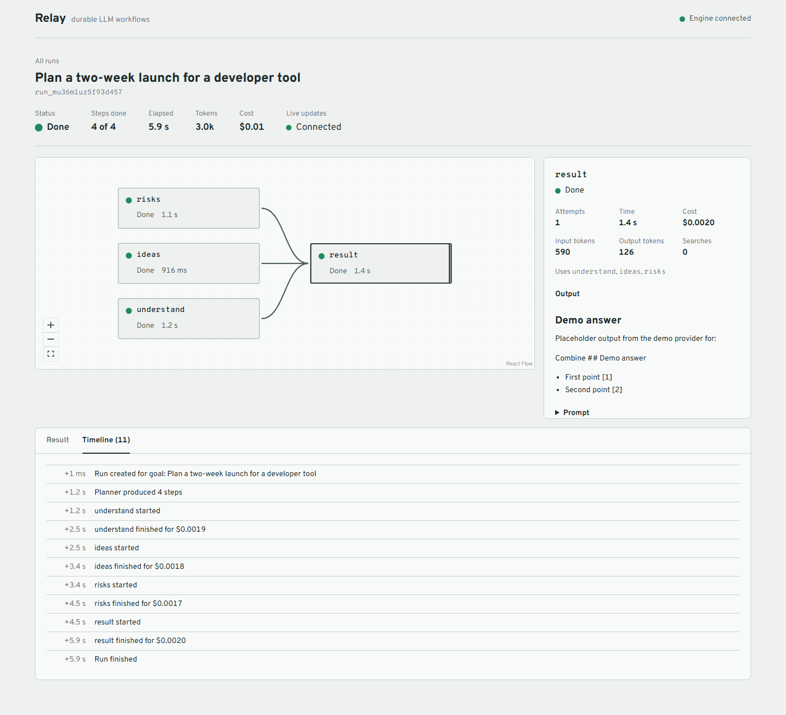
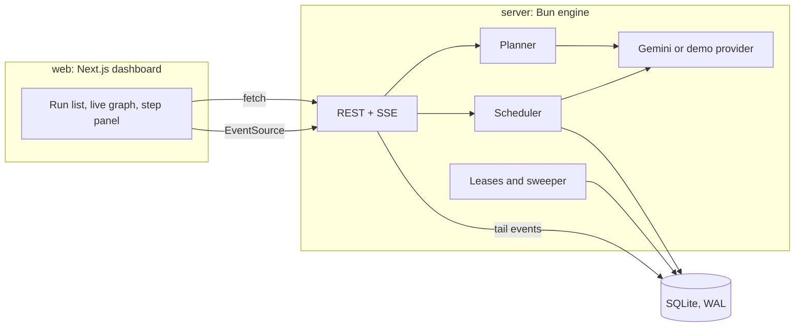

# Relay

A durable workflow engine for LLM agents. Describe a goal, and a planner model turns it into a graph of steps. The engine runs independent steps in parallel, saves every result to SQLite, and picks the run back up after a crash without repeating finished work. A dashboard draws the graph and fills it in live.



## What it does

- **Runs a step the moment its inputs are ready.** The scheduler recomputes the ready set after every step settles, so a slow branch never blocks an unrelated one. On a mixed-latency graph that is 3.83 s instead of 4.65 s for the level-by-level approach it replaced.
- **Passes results between steps.** A prompt can hold `{{step_id.output}}`, `{{step_id.output.field[0]}}` for steps that return JSON, and `{{step_id.sources}}` for search citations. References become dependencies, so the graph cannot disagree with the prompts.
- **Survives a crash.** Each run is owned through a lease that its worker renews every few seconds. If a worker dies, another one claims the run after the lease expires, resets the steps that were in flight, and keeps every finished result.
- **Repairs failed branches.** When a step fails for good, the planner writes replacement steps, and the engine rewires the steps that depended on it.
- **Keeps the cost visible.** Every attempt records input tokens, output tokens, search calls and USD. A run can carry a token or dollar budget, and the engine stops launching steps once it is spent.
- **Streams progress.** The dashboard loads a snapshot, then follows server-sent events, so the graph, the step panel, and the timeline update while the run executes.

## Quick start

```bash
bun install

# No API key: scripted replies with realistic delays
LLM_PROVIDER=demo bun run dev
```

Open http://localhost:3000. The engine listens on http://localhost:4000.

To use Gemini, put a key in `.env` at the repo root (see `.env.example`):

```bash
GOOGLE_API_KEY=your-key
# The Gemini free tier allows 5 requests per minute. Matching it here avoids 429s.
GEMINI_RPM=5
```

Then `bun run dev`.

If your key has no Google Search grounding quota, set `SEARCH_ENABLED=false`. Research runs then answer from model knowledge instead of the web, and the prompts tell the writer not to invent citations.

## How it works



**Planning.** A goal run starts in `planning`. For the research profile the model only picks 3 to 6 sub-questions, and code builds the researcher, fact check and report steps from them, so the shape is guaranteed. For the general profile the model writes the steps itself. Either way the result goes through the same validation as a hand-written graph: unknown ids, self references and cycles are rejected, and the issues go back to the model for up to 3 attempts.

**Scheduling.** A step is ready when every dependency has succeeded. The scheduler starts ready steps up to the run's concurrency, resolves each prompt from saved outputs at launch time, and re-checks the ready set whenever a step settles.

**Failure handling.** Timeouts, 429s, 5xx and JSON that does not match a step's schema are retried with exponential backoff and jitter, and a 429 that carries a retry delay waits exactly that long. Bad requests and template errors fail immediately. A step that runs out of attempts either gets replaced by a re-plan or skips its descendants while other branches continue.

**Durability.** Every state change and its event commit in one SQLite transaction, and the event id doubles as the SSE cursor, so a reconnecting browser replays exactly what it missed. Writes by a run's owner are fenced: they only apply while that worker still holds the lease and the run is still active. A cancel from any process therefore stops the owner's writes at once.

This gives at-least-once execution per step. A step killed mid-call runs again, which is safe here because a model call has no side effects. A step that already succeeded never runs again.

## Crash recovery demo

```bash
cd server && bun run demo:crash
```

It starts two worker processes on one database, kills the first mid-step, and lets the second take over:

```
[demo] killed worker A after step_1, step_2, step_3 finished
[demo] worker B waits for A's 4 s lease to expire, then takes over
[demo] run succeeded 6.8 s after worker B started

finished before the crash: step_1, step_2, step_3
restarted by worker B:      step_4
steps finished twice:       none
final attempts per step:    step_1=1 step_2=1 step_3=1 step_4=2 step_5=1 step_6=1
```

## Benchmark

`cd server && bun run bench` measures scheduling against simulated latency and writes [docs/benchmark.md](docs/benchmark.md). A 12-step research graph that takes 10.40 s one step at a time finishes in 4.49 s at four steps at once, and 3.64 s at eight. The floor is the longest dependency chain.

## HTTP API

| Method and path | What it does |
|---|---|
| `POST /runs` | Starts a run from `{ goal, profile }` or `{ graph }`, plus optional `concurrency`, `maxReplans` and `budget`. Returns `{ runId }` at once. |
| `GET /runs` | Recent runs with step counts and totals. |
| `GET /runs/:id` | The run, its steps, totals, and the id of the last event they include. |
| `GET /runs/:id/events` | Server-sent events, replayed from `Last-Event-ID` or `?after=`. |
| `POST /runs/:id/cancel` | Cancels a planning or running run from any worker process. |
| `POST /runs/:id/retry` | Re-runs the failed and skipped steps of a failed run. |
| `GET /health` | Liveness, the worker id, and the process id. |

Errors are always `{ "error": { "code", "message", "issues"? } }`, and an invalid graph comes back with every validation issue.

A hand-written graph looks like this:

```json
{
  "graph": {
    "steps": [
      { "id": "pros", "prompt": "List the strongest arguments for X." },
      { "id": "cons", "prompt": "List the strongest arguments against X." },
      { "id": "verdict", "prompt": "Weigh these:\n{{pros.output}}\n{{cons.output}}", "final": true }
    ]
  }
}
```

`pros` and `cons` run at the same time, and `verdict` starts when both finish.

## Configuration

Set these in `.env` at the repo root.

| Variable | Default | Notes |
|---|---|---|
| `GOOGLE_API_KEY` | | Required unless `LLM_PROVIDER=demo` |
| `LLM_PROVIDER` | `gemini` | `demo` replies without a key |
| `GEMINI_MODEL` | `gemini-3.5-flash` | |
| `GEMINI_RPM` | `60` | Shared token bucket for every run in the process |
| `SEARCH_ENABLED` | `true` | Turn off for keys without grounding quota |
| `LEASE_TTL_MS` | `30000` | How long a dead worker's runs wait before another claims them |
| `DATABASE_PATH` | `data/relay.db` | |
| `PORT` | `4000` | |
| `WEB_ORIGIN` | `http://localhost:3000` | Allowed origin for the dashboard |
| `PRICE_INPUT_PER_M`, `PRICE_OUTPUT_PER_M`, `PRICE_SEARCH_PER_K` | Gemini 3.5 Flash list prices | Used for cost tracking |

## Layout

```
server/src/engine     graph validation, templates, store, scheduler, engine, leases
server/src/planner    goal to graph, research profile, re-planning
server/src/llm        provider interface, Gemini, demo provider, pricing
server/src/api        REST routes and the event stream
server/scripts        benchmark and crash recovery demo
web/lib               API client, run state reducer, graph layout
web/components        graph, step panel, timeline, forms
docs/design.md        the design this was built from
```

## Tests

```bash
bun run test      # 118 tests: engine, planner, API, dashboard reducer
bun run typecheck
```

The engine tests run two `Engine` instances against one database file to cover lease takeover, fencing and crash recovery, and a fake provider replaces the model, so the suite needs no API key and no network.

## Design decisions

**SQLite instead of a queue and a separate worker pool.** One file, no extra services, and WAL lets several processes share it. Leases and fencing already give the part that matters, which is that exactly one worker drives a run and a stale worker cannot write. Moving to Postgres later changes the store, not the scheduler.

**At-least-once, not exactly-once.** A step interrupted mid-call runs again, because the engine cannot know whether the model answered. That is the right trade for calls with no side effects, and it keeps recovery simple. A step with side effects would need an idempotency key.

**Code owns the graph surgery, the model owns the wording.** The planner picks sub-questions and writes prompts. Building the research shape, merging a re-plan, renaming references and validating the result all happen in code, where they can be tested.

**Budgets stop new steps, not running ones.** Checking before each launch is cheap and predictable. In-flight steps can push the total slightly past the limit.

## Limits

- One model provider. Anything else needs an `LlmProvider` implementation.
- Steps are model calls. There are no HTTP or code steps.
- Several processes can share one machine's database file, not several machines.
- No auth. The dashboard and API are meant to run locally.
