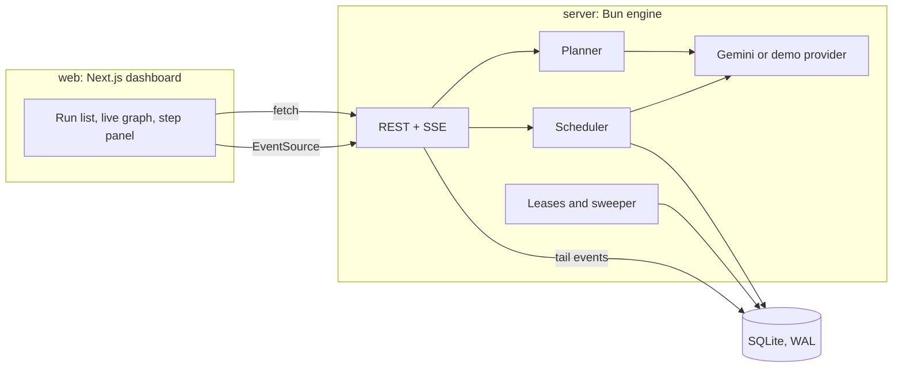

# Relay

A durable workflow engine for LLM agents. Describe a goal, and a planner model turns it into a graph of steps. The engine runs independent steps in parallel, saves every result to SQLite, and picks the run back up after a crash without repeating finished work. A dashboard draws the graph and fills it in live.


## What it does

- Starts each step as soon as its inputs are ready, instead of waiting for a whole level. On a graph with one slow branch that is 3.83 s against 4.65 s for level by level.
- Passes results between steps with templates: `{{step_id.output}}`, `{{step_id.output.field[0]}}` for JSON steps, and `{{step_id.sources}}` for search citations. A reference also adds the dependency, so you don't declare it twice.
- Recovers from a crash. A worker holds each run through a lease it renews every few seconds. If the worker dies, another one claims the run once the lease expires, resets the steps that were in flight, and keeps everything that already finished.
- Re-plans a failed branch. When a step runs out of retries, the planner writes replacement steps and the engine points the downstream steps at them.
- Tracks cost per attempt: input and output tokens, search calls, USD. A run can have a token or dollar budget, and no new steps start once it's spent.
- Streams progress to the dashboard over server-sent events.

## The dashboard

Until you click a step, the side panel shows whatever is relevant: the running step, the failed one, or the final result. Clicking a step puts it in the URL as `?step=`, so you can link to it. Timeline entries also open their step. The result can be copied or downloaded as markdown with its sources. The run list has status filters, search, and delete.

## Quick start

```bash
bun install

# No API key: scripted replies with realistic delays
LLM_PROVIDER=demo bun run dev
```

Open http://localhost:3000. The engine listens on http://localhost:4000.

To use Gemini, put a key in `.env` at the repo root (see `.env.example`):

```bash
GOOGLE_API_KEY=your-key
# The Gemini free tier allows 5 requests per minute. Matching it here avoids 429s.
GEMINI_RPM=5
```

Then `bun run dev`.

If your key has no Google Search grounding quota, set `SEARCH_ENABLED=false`. Research runs then answer from model knowledge, and the prompts tell the writer not to make up citations.

## How it works



**Planning.** A goal run starts in `planning`. For the research profile the model only picks 3 to 6 sub-questions, and code builds the researcher, fact check and report steps from them, so the shape is always the same. For the general profile the model writes the steps itself. Either way the result goes through the same validation as a hand-written graph: unknown ids, self references and cycles are rejected, and the issues go back to the model for up to 3 attempts.

**Scheduling.** A step is ready when every dependency has succeeded. The scheduler starts ready steps up to the run's concurrency, resolves each prompt from saved outputs at launch time, and re-checks the ready set whenever a step settles.

**Failure handling.** Timeouts, 429s, 5xx and JSON that does not match a step's schema are retried with exponential backoff and jitter, and a 429 that carries a retry delay waits exactly that long. Bad requests and template errors fail immediately. A step that runs out of attempts either gets replaced by a re-plan or skips its descendants while other branches continue.

**Durability.** Every state change and its event commit in one SQLite transaction, and the event id doubles as the SSE cursor, so a reconnecting browser replays exactly what it missed. Writes by a run's owner are fenced: they only apply while that worker still holds the lease and the run is still active. A cancel from any process therefore stops the owner's writes at once.

This gives at-least-once execution per step. A step killed mid-call runs again, which is safe here because a model call has no side effects. A step that already succeeded never runs again.

## Crash recovery demo

```bash
cd server && bun run demo:crash
```

It starts two worker processes on one database, kills the first mid-step, and lets the second take over:

```
[demo] killed worker A after step_1, step_2, step_3 finished
[demo] worker B waits for A's 4 s lease to expire, then takes over
[demo] run succeeded 6.8 s after worker B started

finished before the crash: step_1, step_2, step_3
restarted by worker B:      step_4
steps finished twice:       none
final attempts per step:    step_1=1 step_2=1 step_3=1 step_4=2 step_5=1 step_6=1
```

## Benchmark

`cd server && bun run bench` measures scheduling against simulated latency and writes [docs/benchmark.md](docs/benchmark.md). A 12-step research graph that takes 10.40 s one step at a time finishes in 4.49 s at four steps at once, and 3.64 s at eight. The floor is the longest dependency chain.

## HTTP API

| Method and path | What it does |
|---|---|
| `POST /runs` | Starts a run from `{ goal, profile }` or `{ graph }`, plus optional `concurrency`, `maxReplans` and `budget`. Returns `{ runId }` at once. |
| `GET /runs` | Recent runs with step counts and totals. |
| `GET /runs/:id` | The run, its steps, totals, and the id of the last event they include. |
| `GET /runs/:id/events` | Server-sent events, replayed from `Last-Event-ID` or `?after=`. |
| `POST /runs/:id/cancel` | Cancels a planning or running run from any worker process. |
| `POST /runs/:id/retry` | Re-runs the failed and skipped steps of a failed run. |
| `DELETE /runs/:id` | Removes a finished run with its steps and events. An unfinished run has to be cancelled first. |
| `GET /health` | Liveness, the worker id, and the process id. |

Errors are always `{ "error": { "code", "message", "issues"? } }`, and an invalid graph comes back with every validation issue.

A hand-written graph looks like this:

```json
{
  "graph": {
    "steps": [
      { "id": "pros", "prompt": "List the strongest arguments for X." },
      { "id": "cons", "prompt": "List the strongest arguments against X." },
      { "id": "verdict", "prompt": "Weigh these:\n{{pros.output}}\n{{cons.output}}", "final": true }
    ]
  }
}
```

`pros` and `cons` run at the same time, and `verdict` starts when both finish.

## Configuration

Set these in `.env` at the repo root.

| Variable | Default | Notes |
|---|---|---|
| `GOOGLE_API_KEY` | | Required unless `LLM_PROVIDER=demo` |
| `LLM_PROVIDER` | `gemini` | `demo` replies without a key |
| `GEMINI_MODEL` | `gemini-3.5-flash` | |
| `GEMINI_RPM` | `60` | Shared token bucket for every run in the process |
| `SEARCH_ENABLED` | `true` | Turn off for keys without grounding quota |
| `DEMO_FAILURE_RATE` | `0` | With `LLM_PROVIDER=demo`, the share of step calls that fail like an overloaded API. Planner calls never fail, so retries, re-plans and skips can be watched without a key |
| `LEASE_TTL_MS` | `30000` | How long a dead worker's runs wait before another claims them |
| `DATABASE_PATH` | `data/relay.db` | |
| `PORT` | `4000` | |
| `WEB_ORIGIN` | `http://localhost:3000` | Allowed origin for the dashboard |
| `PRICE_INPUT_PER_M`, `PRICE_OUTPUT_PER_M`, `PRICE_SEARCH_PER_K` | Gemini 3.5 Flash list prices | Used for cost tracking |

## Layout

```
server/src/engine     graph validation, templates, store, scheduler, engine, leases
server/src/planner    goal to graph, research profile, re-planning
server/src/llm        provider interface, Gemini, demo provider, pricing
server/src/api        REST routes and the event stream
server/scripts        benchmark and crash recovery demo
web/lib               API client, run state reducer, graph layout, step selection
web/components        graph, step panel, timeline, forms
docs/design.md        design notes: data model, leases, re-planning
```

## Tests

```bash
bun run test
bun run typecheck
```

The engine tests run two `Engine` instances on one database file to test lease takeover, fencing and crash recovery. A fake provider stands in for the model, so the tests need no API key or network.

## Design decisions

SQLite instead of a queue and a worker pool. It's one file and no extra services, and WAL lets several processes share it. The leases and fenced writes already guarantee that one worker drives a run and a stale worker can't write. Moving to Postgres would change the store, not the scheduler.

At-least-once, not exactly-once. A step interrupted mid-call runs again, because the engine can't know whether the model answered. That's fine for model calls since they have no side effects. A step with side effects would need an idempotency key.

The model writes prompts, code changes the graph. The planner picks sub-questions and writes prompts. Building the research shape, merging a re-plan, renaming references and validation all happen in code, where they have tests.

Budgets stop new steps, not running ones. Checking before each launch is cheap. Steps already in flight can push the total a little past the limit.

## Limits

- One model provider. Anything else needs an `LlmProvider` implementation.
- Steps are model calls. There are no HTTP or code steps.
- Several processes can share one machine's database file, not several machines.
- No auth. The dashboard and API are meant to run locally, on a trusted machine.
