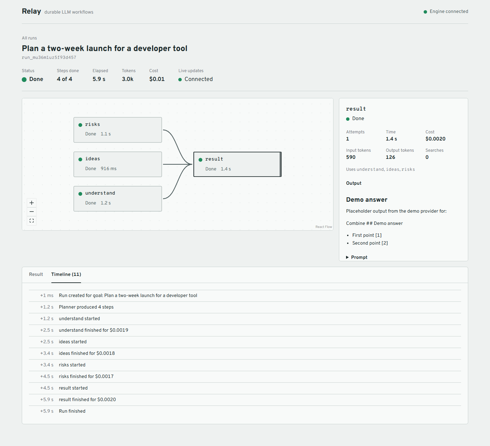
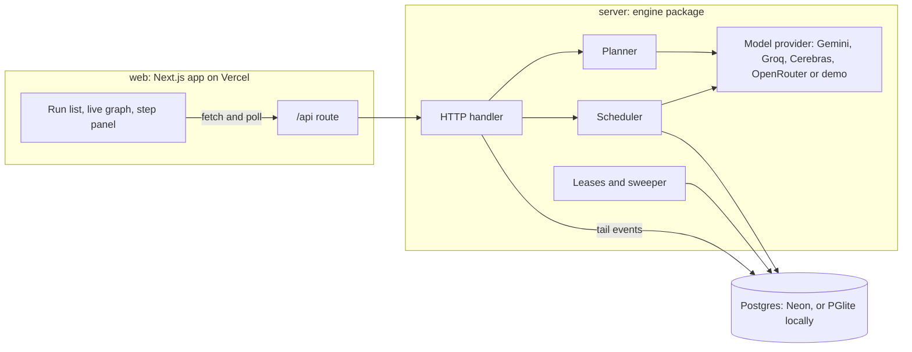

# Relay

A durable workflow engine for LLM agents. Describe a goal, and a planner model turns it into a graph of steps. The engine runs independent steps in parallel, saves every result to Postgres, and picks the run back up after a crash without repeating finished work. A dashboard draws the graph and fills it in live. It is one Next.js app with no separate backend: it deploys to Vercel with a free Neon database and runs on free models from Groq, Cerebras or OpenRouter.



## What it does

- Starts each step as soon as its inputs are ready, instead of waiting for a whole level. On a graph with one slow branch that is 3.83 s against 4.65 s for level by level.
- Passes results between steps with templates: `{{step_id.output}}`, `{{step_id.output.field[0]}}` for JSON steps, and `{{step_id.sources}}` for search citations. A reference also adds the dependency, so you don't declare it twice.
- Recovers from a crash. The function driving a run holds it through a lease it renews every few seconds. If that function dies, for example at Vercel's time limit, the next request claims the run once the lease expires, resets the steps that were in flight, and keeps everything that already finished.
- Re-plans a failed branch. When a step runs out of retries, the planner writes replacement steps and the engine points the downstream steps at them.
- Tracks cost per attempt: input and output tokens, search calls, USD. A run can have a token or dollar budget, and no new steps start once it's spent.
- Updates the dashboard live by polling for new events after the last one it has.

## The dashboard

Until you click a step, the side panel shows whatever is relevant: the running step, the failed one, or the final result. Clicking a step puts it in the URL as `?step=`, so you can link to it. Timeline entries also open their step. The result can be copied or downloaded as markdown with its sources. The run list has status filters, search, and delete.

## Quick start

```bash
bun install

# No API key: scripted replies with realistic delays
LLM_PROVIDER=demo bun run dev
```

Open http://localhost:3000. The dashboard and its API (`/api`) are one app. Without `DATABASE_URL` it stores runs in PGlite, an in-process Postgres, under `web/data/pglite`, so no database server is needed locally.

To use a real model, pick a provider and put its key in `.env` at the repo root (see `.env.example`). Groq, Cerebras and OpenRouter all have free models and need nothing but a key:

```bash
LLM_PROVIDER=groq
GROQ_API_KEY=your-key
```

| `LLM_PROVIDER` | Key | Default model | Free-tier requests per minute |
|---|---|---|---|
| `groq` | `GROQ_API_KEY` from [console.groq.com](https://console.groq.com/keys) | `openai/gpt-oss-120b` | 30 |
| `cerebras` | `CEREBRAS_API_KEY` from [cloud.cerebras.ai](https://cloud.cerebras.ai) | `gpt-oss-120b` | 30 |
| `openrouter` | `OPENROUTER_API_KEY` from [openrouter.ai](https://openrouter.ai/keys) | `nvidia/nemotron-3-super-120b-a12b:free` | 20 |
| `gemini` | `GOOGLE_API_KEY` from [AI Studio](https://aistudio.google.com/apikey) | `gemini-3.5-flash` | 5 on the free tier, so set `LLM_RPM=5` |

Then `bun run dev`. `LLM_MODEL` picks another model from the same provider, for example `openai/gpt-oss-20b` on Groq or any `:free` model on OpenRouter that supports structured outputs.

Only Gemini has a search tool. With the other providers, and with `SEARCH_ENABLED=false` on Gemini, research runs answer from model knowledge, and the prompts tell the writer not to make up citations.

## Deploy

The app deploys to [Vercel](https://vercel.com) as it is, with [Neon](https://neon.com) for the database. Both have free plans that do not sleep: Neon pauses its compute after a few idle minutes and wakes on the next query in well under a second.

1. Push the repo to GitHub.
2. In Vercel, choose **Add New > Project**, import the repository, and set **Root Directory** to `web`. Vercel detects Next.js and installs the Bun workspace from the repo root.
3. Under **Environment Variables**, add `LLM_PROVIDER=groq` and your `GROQ_API_KEY` (or another provider from the table above).
4. Deploy, then open the project's **Storage** tab, choose **Create Database > Neon**, and connect it to the project. That adds `DATABASE_URL`. Redeploy so the functions pick it up. The tables are created on the first request.

The site is live at `https://<project>.vercel.app`.

How a run fits in a serverless function: starting a run launches it inside the request's function, and `after()` keeps the function alive until the run settles, up to Vercel's 300 second limit on the Hobby plan. A run that goes longer loses its function. Its lease expires 30 seconds later, and the next request to `/api`, which the dashboard sends every second while you watch a run, takes it over and continues from the last finished step. A run left alone with nobody watching waits for the next visit.

## How it works


```mermaid
flowchart LR
  subgraph web [web: Next.js app on Vercel]
    UI[Run list, live graph, step panel]
    ROUTE["/api route"]
  end
  subgraph server [server: engine package]
    API[HTTP handler]
    PL[Planner]
    SCH[Scheduler]
    LSE[Leases and sweeper]
    LLM[Model provider: Gemini, Groq, Cerebras, OpenRouter or demo]
  end
  DB[(Postgres: Neon, or PGlite locally)]

  UI -- fetch and poll --> ROUTE --> API
  API --> PL --> LLM
  API --> SCH --> LLM
  SCH --> DB
  LSE --> DB
  API -- tail events --> DB
```

**Planning.** A goal run starts in `planning`. For the research profile the model only picks 3 to 6 sub-questions, and code builds the researcher, fact check and report steps from them, so the shape is always the same. For the general profile the model writes the steps itself. Either way the result goes through the same validation as a hand-written graph: unknown ids, self references and cycles are rejected, and the issues go back to the model for up to 3 attempts.

**Scheduling.** A step is ready when every dependency has succeeded. The scheduler starts ready steps up to the run's concurrency, resolves each prompt from saved outputs at launch time, and re-checks the ready set whenever a step settles.

**Failure handling.** Timeouts, 429s, 5xx and JSON that does not match a step's schema are retried with exponential backoff and jitter, and a 429 that carries a retry delay waits exactly that long. Bad requests and template errors fail immediately. A step that runs out of attempts either gets replaced by a re-plan or skips its descendants while other branches continue.

**Durability.** Every state change and its event commit in one Postgres transaction that holds the run's row lock, and the event id doubles as the dashboard's polling cursor, so it picks up exactly what it has not seen. Writes by a run's owner are fenced: they only apply while that worker still holds the lease and the run is still active. A cancel from any function therefore stops the owner's writes at once.

This gives at-least-once execution per step. A step killed mid-call runs again, which is safe here because a model call has no side effects. A step that already succeeded never runs again.

## Crash recovery demo

```bash
cd server && bun run demo:crash
```

It starts two engines on one database, stops the first mid-step with no cleanup, the way a function dies at its time limit, and lets the second take over:

```
[demo] worker A died after step_1, step_2, step_3 finished
[demo] worker B waits for A's 4 s lease to expire, then takes over
[demo] run succeeded 6.8 s after worker B started

finished before the crash: step_1, step_2, step_3
restarted by worker B:      step_4
steps finished twice:       none
final attempts per step:    step_1=1 step_2=1 step_3=1 step_4=2 step_5=1 step_6=1
```

## Benchmark

`cd server && bun run bench` measures scheduling against simulated latency and writes [docs/benchmark.md](docs/benchmark.md). A 12-step research graph that takes 10.40 s one step at a time finishes in 4.49 s at four steps at once, and 3.64 s at eight. The floor is the longest dependency chain.

## HTTP API

The routes live under `/api`.

| Method and path | What it does |
|---|---|
| `POST /runs` | Starts a run from `{ goal, profile }` or `{ graph }`, plus optional `concurrency`, `maxReplans` and `budget`. Returns `{ runId }` at once. |
| `GET /runs` | Recent runs with step counts and totals. |
| `GET /runs/:id` | The run, its steps, totals, and the id of the last event they include. |
| `GET /runs/:id/events?after=` | Up to 500 events after the given event id, oldest first. The dashboard polls this. |
| `POST /runs/:id/cancel` | Cancels a planning or running run, whichever function drives it. |
| `POST /runs/:id/retry` | Re-runs the failed and skipped steps of a failed run. |
| `DELETE /runs/:id` | Removes a finished run with its steps and events. An unfinished run has to be cancelled first. |
| `GET /health` | Liveness and the worker id. |

Errors are always `{ "error": { "code", "message", "issues"? } }`, and an invalid graph comes back with every validation issue.

A hand-written graph looks like this:

```json
{
  "graph": {
    "steps": [
      { "id": "pros", "prompt": "List the strongest arguments for X." },
      { "id": "cons", "prompt": "List the strongest arguments against X." },
      { "id": "verdict", "prompt": "Weigh these:\n{{pros.output}}\n{{cons.output}}", "final": true }
    ]
  }
}
```

`pros` and `cons` run at the same time, and `verdict` starts when both finish.

## Configuration

Set these in `.env` at the repo root for local development, and under the project's Environment Variables on Vercel.

| Variable | Default | Notes |
|---|---|---|
| `LLM_PROVIDER` | `gemini` | `gemini`, `groq`, `cerebras`, `openrouter`, or `demo`, which replies without a key |
| `GOOGLE_API_KEY`, `GROQ_API_KEY`, `CEREBRAS_API_KEY`, `OPENROUTER_API_KEY` | | Only the chosen provider's key is required |
| `LLM_MODEL` | The provider's default free model | `GEMINI_MODEL` still works for Gemini |
| `LLM_RPM` | The provider's free-tier limit, or `60` for Gemini | Shared token bucket for every run in the process. `GEMINI_RPM` still works for Gemini |
| `SEARCH_ENABLED` | `true` | Gemini only. Turn off for keys without grounding quota |
| `DEMO_FAILURE_RATE` | `0` | With `LLM_PROVIDER=demo`, the share of step calls that fail like an overloaded API. Planner calls never fail, so retries, re-plans and skips can be watched without a key |
| `LEASE_TTL_MS` | `30000` | How long a dead worker's runs wait before another claims them |
| `DATABASE_URL` | | Postgres connection string. Use Neon's pooled one. Required on Vercel |
| `PGLITE_DIR` | `data/pglite` | Where runs are stored when `DATABASE_URL` is not set |
| `PRICE_INPUT_PER_M`, `PRICE_OUTPUT_PER_M`, `PRICE_SEARCH_PER_K` | Gemini 3.5 Flash list prices, or `0` for the free providers | Used for cost tracking |

## Layout

```
server/src/engine     graph validation, templates, Postgres store, scheduler, engine, leases
server/src/planner    goal to graph, research profile, re-planning
server/src/llm        provider interface, Gemini, OpenAI-compatible APIs, demo provider, pricing
server/src/api        HTTP routes as a fetch-style handler
server/src/relay.ts   builds the engine from the environment
server/scripts        benchmark and crash recovery demo
web/app/api          the catch-all route that runs the engine
web/lib               API client, run state reducer, graph layout, step selection
web/components        graph, step panel, timeline, forms
docs/design.md        design notes: data model, leases, re-planning
```

## Tests

```bash
bun run test
bun run typecheck
```

The engine tests run two `Engine` instances on one database to test lease takeover, fencing and crash recovery. They use an in-memory PGlite, and a fake provider stands in for the model, so they need no database server, API key or network. `TEST_DATABASE_URL=postgres://...` runs the same tests against a real Postgres server; CI does both.

## Design decisions

Postgres instead of a queue and a worker pool. Leases and fenced writes already guarantee that one worker drives a run and a stale worker can't write, so the database is the only shared piece. That is what lets the engine run inside serverless functions: any instance can pick up any run.

Polling instead of a stream. A server-sent event stream would keep a function running for as long as a page stays open. A poll is one short query, and the dashboard slows down once a run has finished.

At-least-once, not exactly-once. A step interrupted mid-call runs again, because the engine can't know whether the model answered. That's fine for model calls since they have no side effects. A step with side effects would need an idempotency key.

The model writes prompts, code changes the graph. The planner picks sub-questions and writes prompts. Building the research shape, merging a re-plan, renaming references and validation all happen in code, where they have tests.

Budgets stop new steps, not running ones. Checking before each launch is cheap. Steps already in flight can push the total a little past the limit.

## Limits

- One model per process. Other APIs need an `LlmProvider` implementation unless they speak the OpenAI chat completions format.
- Steps are model calls. There are no HTTP or code steps.
- A run longer than the function limit (300 s on Vercel Hobby) only continues while someone has the dashboard open, since requests are what resume it.
- No auth. Anyone with the link to a deployment can start, cancel and delete runs, and every run spends the deployment's API quota.
