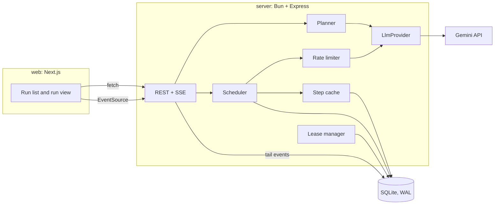
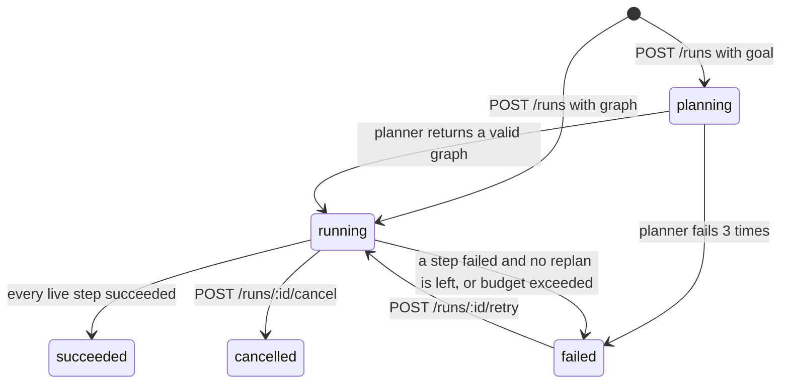

# Design notes

Relay is a durable workflow engine for LLM agents. You give it a goal. A planner model turns the goal into a graph of steps, the engine runs independent steps in parallel, and every result lands in SQLite. If the process dies, another process picks the run up and continues from the last finished step. A Next.js dashboard draws the graph and updates it live.

## Problem

A useful agent pipeline makes 10 to 50 model calls. Somewhere in the middle one of them hits a rate limit, times out, or the server restarts. A naive runner loses the whole run and starts over, which costs time and money. It also gives no answer to "which step is running, which failed, and what did each step cost?"

Single-agent loops (ReAct style) have a second problem. They do one thing at a time, so a task with five independent research questions takes five times longer than it needs to.

## Goals

1. Run a DAG of LLM steps with the maximum safe parallelism.
2. Never re-run a step that already succeeded, even across crashes and restarts.
3. Build the DAG from a natural-language goal and repair failed branches by re-planning.
4. Produce cited research reports using Gemini with Google Search grounding.
5. Show runs live: graph, per-step status, outputs, sources, tokens, and cost.

## Non-goals

- Human approval or pause-for-input steps.
- Arbitrary code or HTTP steps. Every step is a model call.
- Multi-tenant auth. The dashboard runs locally.
- Distributed execution across machines. Several engine processes can share one SQLite file on one machine.

## Architecture



The repo has two Bun workspaces.

- `server/` owns all state. It is the only thing that talks to SQLite and Gemini.
- `web/` is a Next.js App Router app. It holds no state of its own and reads everything from the server over HTTP.

Runs can take minutes, and a Next.js dev reload restarts the web process. Keeping the engine separate means a reload does not kill a run.

## Workflow definition

```ts
type StepDef = {
  id: string;                 // /^[a-z][a-z0-9_]{0,39}$/
  prompt: string;             // may contain templates
  dependsOn?: string[];       // merged with ids referenced in the prompt
  tools?: ("search")[];       // Gemini Google Search grounding
  output?: { type: "text" } | { type: "json"; schema: JsonSchema };
  retries?: number;           // 0..5, default 2
  timeoutMs?: number;         // 1_000..300_000, default 90_000
  cache?: boolean;            // default false
  final?: boolean;            // marks the report step for the UI
};

type Graph = { steps: StepDef[] };
```

### Templates

A template is resolved when its step starts, from the saved outputs of finished steps.

| Template | Value |
|---|---|
| `{{a.output}}` | Output text of step `a`. For a JSON step, the pretty-printed JSON. |
| `{{a.output.items[0].name}}` | A value inside a JSON output. Objects render as JSON, strings render raw. |
| `{{a.sources}}` | Numbered list of search sources from step `a`: `[1] Title - https://...` |
| `{{goal}}` | The run's goal, or an empty string for hand-written graphs. |

A path that does not exist in the JSON output fails the step with a `TemplateError` and no retry, because retrying cannot fix it.

### Validation

`validateGraph(graph)` returns either a normalized graph or a list of issues. The API returns 400 with every issue, and the planner feeds the same list back to the model. Checks, in order:

1. The shape matches the zod schema, and the graph has 1 to 50 steps.
2. Step ids are unique.
3. Every id in `dependsOn` and every template reference exists. A step may not reference itself.
4. Template references are added to `dependsOn`.
5. There are no cycles. Kahn's algorithm removes nodes with in-degree zero. If nodes remain, a DFS over them finds one cycle and reports it as `cycle: a -> b -> c -> a`.
6. A JSON output schema is an object the provider accepts (`type` present, no empty `properties`).

## Data model

SQLite through `bun:sqlite`, with `journal_mode=WAL` and `busy_timeout=5000` so several processes can share the file.

```sql
runs (
  id TEXT PRIMARY KEY,
  goal TEXT,
  profile TEXT,                 -- 'general' | 'research' | NULL for hand-written graphs
  graph_json TEXT,              -- current graph, NULL while planning
  graph_version INTEGER NOT NULL DEFAULT 0,
  status TEXT NOT NULL,         -- planning | running | succeeded | failed | cancelled
  error TEXT,
  concurrency INTEGER NOT NULL,
  max_replans INTEGER NOT NULL,
  replans INTEGER NOT NULL DEFAULT 0,
  budget_tokens INTEGER,
  budget_usd REAL,
  planning_input_tokens INTEGER NOT NULL DEFAULT 0,   -- planner and replanner calls
  planning_output_tokens INTEGER NOT NULL DEFAULT 0,
  planning_cost_usd REAL NOT NULL DEFAULT 0,
  lease_owner TEXT,
  lease_expires_at INTEGER,     -- epoch ms
  created_at INTEGER NOT NULL,
  updated_at INTEGER NOT NULL
)

steps (
  run_id TEXT NOT NULL,
  step_id TEXT NOT NULL,
  graph_version INTEGER NOT NULL,
  status TEXT NOT NULL,         -- pending | running | succeeded | failed | skipped | superseded
  attempt INTEGER NOT NULL DEFAULT 0,
  resolved_prompt TEXT,
  output TEXT,
  sources_json TEXT,
  error TEXT,
  input_tokens INTEGER NOT NULL DEFAULT 0,
  output_tokens INTEGER NOT NULL DEFAULT 0,
  search_calls INTEGER NOT NULL DEFAULT 0,
  cost_usd REAL NOT NULL DEFAULT 0,
  cached INTEGER NOT NULL DEFAULT 0,
  started_at INTEGER,
  finished_at INTEGER,
  PRIMARY KEY (run_id, step_id)
)

events (
  id INTEGER PRIMARY KEY AUTOINCREMENT,
  run_id TEXT NOT NULL,
  type TEXT NOT NULL,
  payload_json TEXT NOT NULL,
  created_at INTEGER NOT NULL
)

step_cache (
  key TEXT PRIMARY KEY,         -- sha256 of model, resolved prompt, tools, output schema
  output TEXT NOT NULL,
  sources_json TEXT,
  created_at INTEGER NOT NULL
)
```

Token counts and cost live only on `steps`. Run totals come from `SUM` over the run's steps, so the two can never disagree. Tokens from failed attempts are added to the step as they happen, because failed calls still cost money.

Every state change and its event are written in one transaction. The event id is the SSE event id.

### Event types

`run.created`, `run.planned`, `step.started`, `step.retrying`, `step.succeeded`, `step.failed`, `step.skipped`, `run.replanned`, `run.replan_failed`, `run.budget_exceeded`, `run.lease_taken`, `run.retried`, `run.succeeded`, `run.failed`, `run.cancelled`.

## Engine

### Run lifecycle



### Scheduling

The scheduler for one run keeps an in-memory view of the step table, loaded from SQLite when it starts.

1. A step is ready when it is `pending` and every dependency is `succeeded`.
2. While fewer than `concurrency` steps are in flight and the ready set is not empty, it takes the ready step that comes first in topological order and launches it.
3. When any step settles, it writes the result, then re-computes the ready set. The scheduler never waits for a whole level, so a slow step does not block unrelated branches.
4. When nothing is in flight and nothing is ready, the run is finished. It succeeds if every step with a live status (anything but `superseded`) succeeded.

### Executing a step

1. Resolve templates. Write `status=running`, `attempt+1`, and `resolved_prompt`, and emit `step.started`.
2. If `cache` is on, look up the cache key. On a hit, save the output with `cached=1`, zero cost, and finish.
3. Wait for a rate limiter token. Waiting time does not count against the timeout.
4. Call the provider with a signal that aborts on run abort or when `timeoutMs` passes. The timeout runs on the injected clock, so tests drive it without sleeping.
5. On success with `output.type = "json"`, parse the text and validate it against the schema with Ajv. A parse or schema failure counts as a retryable error, and the next attempt's prompt gets the validation error appended.
6. Save output, sources, and usage, and emit `step.succeeded`.

### Retries

`classify(error)` returns `retryable` or `fatal`.

- Retryable: timeouts, network errors, HTTP 429, HTTP 5xx, and JSON output that fails to parse or validate.
- Fatal: HTTP 400, 401, and 403, template errors, and aborts caused by cancel.

A retryable error with attempts left waits `min(30s, 1s * 2^(attempt-1)) * random(0.5..1.5)`, emits `step.retrying`, and tries again. A 429 with a `retry-after` value waits that long instead. Otherwise the step becomes `failed`.

### Failure and re-planning

When a step fails for good:

1. If the run has a goal and `replans < max_replans` (default 2), the engine calls the replanner. It sends the goal, the failed step's prompt and error, and the output of every succeeded step truncated to 2,000 characters.
2. The model writes 1 to 3 replacement steps. They may reference only succeeded steps or each other. The last one stands in for the failed step and inherits its output contract (text, or the same JSON schema).
3. Code, not the model, rewires the graph. The failed step and its unfinished descendants become `superseded`. Each descendant is recreated under a new id (`report` becomes `report_r2`) with its template references renamed, so `{{failed.output.x}}` becomes `{{replacement.output.x}}`. Ids that collide with existing rows get the next free `_rN` suffix.
4. The merged graph goes through `validateGraph`. Issues go back to the model, up to 3 attempts. On success the engine installs it as the next `graph_version`, emits `run.replanned`, and the scheduler reloads and continues.
5. If there are no re-plans left, or re-planning fails, every descendant of the failed step becomes `skipped`. Independent branches keep running, and the run ends `failed`.

Failure hooks run one at a time, so two branches failing together cannot replan over each other.

### Budgets

A run may set `budget_tokens`, `budget_usd`, or both. Before each launch the scheduler reads the run totals. If a limit is reached, it stops launching, marks pending steps `skipped` with reason `budget`, lets in-flight steps finish, and ends the run `failed` with `budget exceeded`. In-flight steps can push the total past the limit by their own usage.

### Rate limiting

A token bucket with capacity `GEMINI_RPM / 6` that refills at `GEMINI_RPM / 60` tokens per second. Every run in the process shares it. `acquire(signal)` resolves in FIFO order and rejects if the signal aborts while waiting.

### Step cache

The key is `sha256(JSON.stringify([model, resolvedPrompt, tools, outputSchema]))`. It is opt-in per step, because search results change over time. Hits are saved like normal results with `cached=1` so the UI can show them.

### Leases, crash recovery, and multiple processes

Each engine process gets a `workerId` (a random UUID) at start.

- **Claim.** `UPDATE runs SET lease_owner=?, lease_expires_at=now+30s WHERE id=? AND status IN ('planning','running') AND (lease_owner IS NULL OR lease_expires_at < now)`. The process drives the run only if the update changed one row. A run claimed while `planning` is planned again from the start.
- **Heartbeat.** Every 10 seconds the owner extends the lease with `WHERE id=? AND lease_owner=?`. If that changes zero rows, another process took the run. The owner aborts its scheduler and drops its in-flight results without writing them.
- **Sweeper.** Every 5 seconds, and once at startup, each process looks for `running` runs with no live lease and claims them. A claimed run resets its `running` steps to `pending`, keeping their attempt counts, and emits `run.lease_taken`.
- **Fencing.** Every owner write includes `AND EXISTS (SELECT 1 FROM runs WHERE id=? AND lease_owner=? AND status IN ('planning','running'))`. A stale owner that wakes up after losing its lease cannot overwrite the new owner's work. Because the fence also checks status, a cancel written by any process blocks the owner's writes at once, and the owner's next heartbeat aborts its in-flight calls.
- **Graceful shutdown.** On SIGINT or SIGTERM the process stops claiming, aborts in-flight calls, resets its running steps to `pending`, clears its leases, and exits. Another process, or the next start, resumes right away without waiting 30 seconds.

This gives at-least-once execution per step. A step killed in the middle of a model call runs again, which is acceptable for model calls because they have no side effects. A succeeded step never runs again.

## Planner

`POST /runs` with `{ goal, profile }` creates a run in `planning` and returns at once. Planning happens in the background.

1. Build the prompt for the run's profile.
2. Call the model with `responseMimeType: "application/json"` and a hand-written response schema. A step's output schema travels as a JSON string (`outputJsonSchema`), because Gemini's schema subset cannot describe "any JSON Schema".
3. Convert the reply to `StepDef`s and run `validateGraph`. On issues, send the model its previous reply and the issue list, up to 3 attempts in total.
4. On success, save the graph as version 1 together with the planning token usage, emit `run.planned`, and start scheduling. After 3 failed attempts the run ends `failed` with the last issues in the `run.failed` event.

### Profiles

**general.** The model writes 2 to 12 steps. The prompt tells it to keep independent work free of dependencies so it runs in parallel. If no step is marked `final`, the last step nothing depends on gets the mark.

**research.** The model only picks 3 to 6 sub-questions. Code builds the graph from them, so the shape is guaranteed:

1. One `research_<topic>` step per sub-question with search and JSON output `{ summary, findings[] }`.
2. One `verify` step that reads every research output, uses search, and returns JSON `{ confirmed[], disputed[{ claim, reason }] }`.
3. One `write` step marked `final` that reads the research outputs, their `{{research_x.sources}}`, and the fact check, and writes a markdown report with one numbered reference list.

`SEARCH_ENABLED=false` builds the same graph without search and tells the steps to answer from model knowledge without inventing citations. It exists for API keys that have no grounding quota.

## LLM provider

```ts
interface LlmProvider {
  readonly model: string;
  generate(req: {
    prompt: string;
    tools?: ("search")[];
    jsonSchema?: object;
    signal: AbortSignal;
  }): Promise<{
    text: string;
    sources: { title: string; url: string }[];
    usage: { inputTokens: number; outputTokens: number; searchCalls: number };
  }>;
}
```

`GeminiProvider` maps `usageMetadata.promptTokenCount` plus `toolUsePromptTokenCount` to input tokens, and `candidatesTokenCount` plus `thoughtsTokenCount` to output tokens. It reads `groundingMetadata.groundingChunks[].web` for sources and counts `webSearchQueries.length > 0` as one search call. Errors turn into `LlmError { status, retryAfterMs }`.

Default pricing for `gemini-3.5-flash` is $1.50 per 1M input tokens, $9.00 per 1M output tokens, and $14 per 1,000 search calls. `PRICE_INPUT_PER_M`, `PRICE_OUTPUT_PER_M`, and `PRICE_SEARCH_PER_K` override them.

`FakeProvider` takes a handler `(req, callIndex) => result | Error` and an optional delay. Tests and the benchmark use it, so neither needs an API key.

## Dashboard

Next.js App Router with Tailwind, `@xyflow/react` for the graph, `@dagrejs/dagre` for left-to-right layout, and `react-markdown` for reports.

- **`/`** shows the run list with status, goal, step counts, cost, and age. Two forms start runs: a goal box with a profile picker and budget fields, and a JSON graph editor that shows validation issues returned by the API.
- **`/runs/[id]`** has four parts.
  - A header with status, elapsed time, tokens, cost, graph version, and Cancel and Retry buttons.
  - The graph. Node color follows status, edges into running steps animate, cached steps get a badge, and superseded steps render faded. A replan re-fetches the run and runs the layout again.
  - A side panel for the selected step: resolved prompt, output (markdown or JSON), sources as links, attempts, error, tokens, and cost.
  - Tabs for the final report and the event timeline.

Live updates use one `EventSource` per page. A reducer applies each event to the run state. `EventSource` reconnects on its own and sends `Last-Event-ID`, so no events go missing.

## Benchmark and demos

`bun run bench` runs a 12-step research-shaped graph on `FakeProvider` with fixed per-step latency, at 1, 2, 4 and 8 steps at once, and compares Relay's scheduler with the level-by-level approach on a mixed-latency graph. It writes `docs/benchmark.md`.

`bun run demo:crash` starts two engine processes on one database, kills the first mid-step, and checks that the second finishes the run without repeating a finished step.
